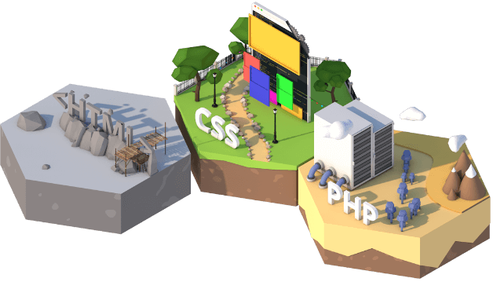
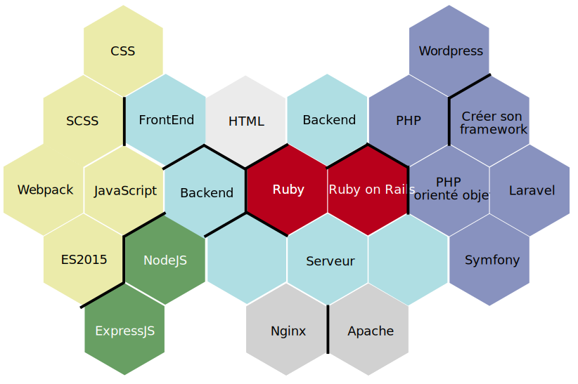

# Carte d'apprentissage

> Carte d'apprentissage pour Grafikart.fr

L'objectif de ce projet est de rendre l'apprentissage plus ludique tout en permettant de guider l'utilisateur au long de son apprentissage sur [Grafikart.fr](https://www.grafikart.fr). 

L'utilisateur commencera son apprentissage sur la première case **HTML** où il devra compléter la formation (série de vidéo + exercices?) afin d'obtenir l'accès au cases adjacentes. 

## 🍱 Architecture

- Les zones en bleu clair sont des passerelles, elles ne contiendront pas de tests mais permettront à l'utilisateur de choisir vers quoi s'orienter (backend, frontend, devops...)
- Des "murs" pourront empêcher des cases adjacentes d'être accessibles (utile pour garder la carte compact).
- La carte complète n'est pas forcément évidente à lire et ne sera pas présentée directement à l'utilisateur. Le focus se fera sur la formation en cours d'aprentissages et les cases adjacentes accessibles. L'objectif est de ne pas décourager les personnes en affichant des dixaines de technologies à apprendre d'un coup.

## 👬 Participer

Si vous le souhaitez vous pouvez participer à ce projet de plusieurs façons :

- Si vous avez des compétences en **modélisation 3D** ou **rendu** vous pouvez proposer des idées pour certaines cases.
- Si vous proposez des formations (visible sans inscription préalable) n'hésitez pas à proposer le lien dans les issues. Une section dédiée à des formations externes au site sera disponible pour chaque case pour améliorer la diversité.
- Sinon vous pouvez simplement faire une PR pour proposer des changements au niveau de l'agencement de la carte.

## 💡 Idées

Je met ici certaines idées que je ne suis pas sûr de réaliser (à voir l'impact en terme de temps). Vous pouvez aussi en proposer d'autres en faisant une PR.

- Proposer un système de progression au niveau de chaque cases (chaque chapitre rajouterais un élément ou ferait évoluer la case à la manière d'un STR)
- Créer des exercices / tests pour s'assurer que les notions sont aquises (faire ça en interne ou chercher un tiers pour ces tests)
- Animations en CSS ou en vidéo ?

## 👻 Problèmes

> Comment gérer le cas du JavaScript qui est à la fois au début de la partie FrontEnd (avec jQuery, VueJS...) et dans la partie Backend avec NodeJS ? 

Je considère qu'on commence à apprendre le JavaScript par le front end, il faut donc proposer NodeJS après cette partie là.
